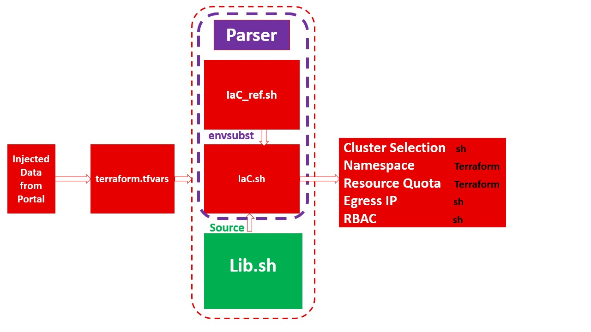

# container_request_project

Welcome to the IaC-using-terraform-and-bash wiki! This project aims to create infrastructure " Openshift projects with some specific parameters like resourceQuota and EgressIP" using terraform. As per the current limitation to do so using terraform provider for k8s, part of the code was written using shell script to complete the required scope.

=================================================================

**Parser.sh**
    This bash script performs the task of setting up and configuring an infrastructure as code. It first checks if the necessary files, such as terraform.tfvars and IaC files, are present and valid. If they are, it then proceeds to assign variable values to the EgressIP, project, Site, NT, and GroupDL, which are defined in the terraform.tfvars file. It then uses envsubst to substitute these variable values in the IaC_ref.sh file and write them to the IaC.sh file. Finally, the IaC.sh file is executed to set up and configure the infrastructure as code.

=================================================================

**The libaray "Lib.sh"**

The bash script provided contains three separate functions: EgressIPadder, GroupAdministration, and SiteSelector. 

1. The first function, **EgressIPadder**, is used to add an egress IP address to selected nodes in a specified network namespace. This is done by first checking to ensure that the OpenShift CLI tools are installed, and then proceeding to patch the network namespace and hostsubnet objects with the specified IP address. 
2. The second function, **GroupAdministration**, is used to add an edit role to the requester’s group in the specified OpenShift cluster. This is accomplished by first checking to see if the requester’s group exists in the cluster, and then by adding the edit role to the requester’s group, as well as to the devops group. If the requester’s group does not exist in the cluster, the system administrator is contacted.
3. The third function, **SiteSelector**, provided is used to select the site for the application and configure the corresponding environment. The script starts by checking the input argument and then sets the corresponding KUBECONFIG depending on the argument. After that, a terraform plan is executed and then terraform apply is executed with arguments from the KUBECONFIG. Finally, the open shift node selector is annotated, and the namespace is then labeled with the third argument for the script. The script is repeated for each environment and is completed by labeling the namespace with the third argument.

=================================================================

**IaC_ref.sh and IaC.sh**

**IaC_ref.sh** is used to select a site, add an egress IP address to the selected nodes, and administer a group. The script begins by sourcing the Lib.sh library. It then uses the SiteSelector function to select a site, a project, and a label. Then, the EgressIPadder function is used to add an egress IP address to the project. Lastly, the GroupAdministration function is used to adminstrate Groups on the specified project, or create it and assign permissions. Finally, the KUBECONFIG variable is unset, and the terraform.tfstate file is removed.

**IaC.sh** is using variable values after envsubst at parser.sh , As with the first script, the KUBECONFIG variable is unset, and the terraform.tfstate file is removed.

=================================================================

**Terraform YAML files**

**Main.tf** sets up the provider configuration to connect to a Kubernetes cluster, and then creates a namespace resource with the name specified in the "var.project" variable. 

**project.tf** sets up a resource quota in the same namespace as Main.tf. The "hard" parameter sets the quotas for each resource type to the values specified in the "var.quotapods", "var.quotacpurequest", "var.quotamemoryrequest", "var.quotacpulimit", "var.quotamemorylimit" and "var.quotastorage" variables. Using the resource quota, the Kubernetes cluster is able to limit the resources available to each namespace, ensuring that the resources are utilized effectively and efficiently.

=================================================================

A role which allow Servic account  .. to give another service account admin cluster role

oc create clusterrole permissionsrole --verb=* --resource=roles,rolebindings,clusterroles,clusterrolebindings
oc adm policy add-cluster-role-to-user permissionsrole -z oc-sa
=================================================================

